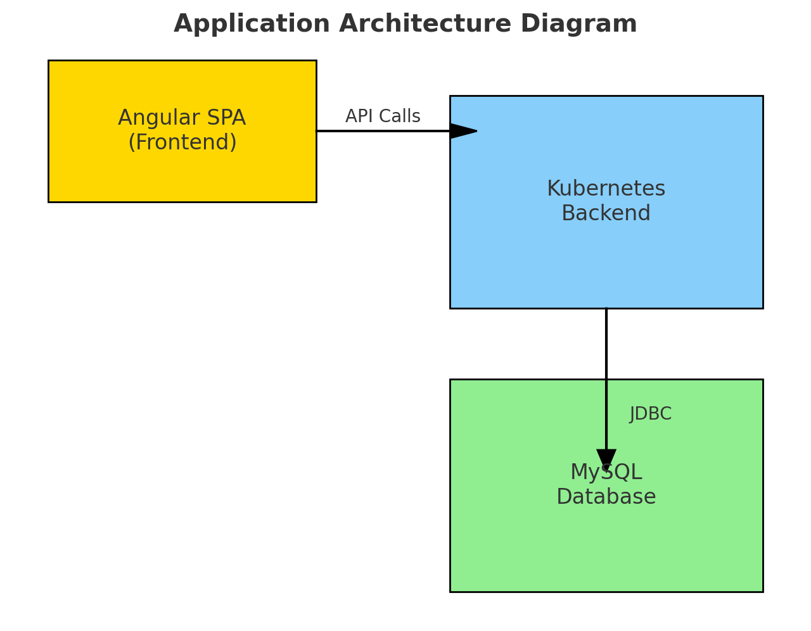

## Overview

This project implements a Player Management API that supports:
- Displaying all players in a table view with sorting and filtering.
- Extending the API to handle match records and returning results based on match outcomes.

The API is built using Java with Spring Boot and is containerized using Docker. Helm charts are provided for deploying the application on Kubernetes. Additionally, an frontend Angular app is provided to interact with the APIs.

## Architecture

This application consists of a backend API built with Spring Boot, a frontend single-page application (SPA) developed with Angular, and a MySQL database for data persistence. The API stack is containerized using Docker and orchestrated with Kubernetes, with Helm charts managing the deployment on a local Minikube cluster.

Spring Boot is widely used for building scalable and production-ready APIs. It integrates well with various databases, offers robust security features, and has a rich ecosystem of tools and libraries. Given that the company uses this stack, it ensures alignment with industry practices and existing workflows. Angular is a powerful framework for building SPAs, offering two-way data binding, modular architecture, and strong community support. It was chosen to ensure the frontend is highly maintainable, scalable, and aligned with the company's technology stack. MySQL is a reliable and widely-used relational database management system. It supports complex queries, indexing, and transactions, making it a good fit for the application's needs. Docker simplifies the deployment process by creating a consistent environment for both the API and frontend. This ensures that the application behaves the same way in development, testing, and production. Kubernetes is the leading container orchestration platform, offering features like auto-scaling, self-healing, and rolling updates. Helm simplifies Kubernetes application management by packaging Kubernetes resources into a single, reusable chart, making deployment and upgrades more manageable.

The chosen stack reflects a balance between industry best practices and alignment with the company's existing technologies. By utilizing Spring Boot, Angular, and MySQL, the application leverages widely adopted and supported technologies that are both scalable and maintainable. Docker and Kubernetes ensure that the application is easily deployable and can handle scaling demands as needed, while Helm simplifies the management of Kubernetes resources.

Additionally, this stack offers a clear separation of concerns:

Backend (Spring Boot) focuses on data processing and business logic.
Frontend (Angular) handles user interactions and presents data to the user.
Database (MySQL) manages data storage and retrieval.
This modularity ensures that each component can be developed, tested, and maintained independently, promoting a more efficient development process and a more robust application.

### Player Management API
The API follows a RESTful architecture. The main components include:
- **Controller**: Handles incoming HTTP requests.
- **Service**: Contains the business logic.
- **Repository**: Interacts with the database.

### Data Model
- **Player**: Represents a player with attributes `ID`, `Name`, `Age`, `Address 1`, `Address 2`.
- **Match**: Represents a match with attributes `ID`, `winner_id`, `looser_id`.

### Database
The API uses a relational database to store players and match records. For this implementation, MySQL is used for its robust indexing and query optimization capabilities.

## Technologies Used
- **Backend**: Java, Spring Boot, JPA/Hibernate (WIth direct SQL queries)
- **Frontend (optional)**: Angular
- **Database**: MySQL
- **Containerization**: Docker
- **Deployment**: Kubernetes (Minikube) with Helm

### Versions used
- Java 22.0.2
- Maven 3.9.8
- Docker 27.0.3
- Kubernetes (minikube v1.33.1) and Helm (v3.15.4)
- MySQL 8.4.2
- NodeJS v20.16.0
- Angular 18.1.4

### How to run
1. Clone the repository:
   git clone https://github.com/mainala/broadcom-assignment.git
3. run the provided data.sql file to create dummy data for the project
4. update the MySQL username and password in the demo-chart > Values.yaml (JDBC_USERNAME and JDBC_PASSWORD). Do not change the database url or it will not work with minikube.
5. Go to the project root directory and start minikube with the following command: "minikube start"
6. Package the provided helm chart: "helm package demo-chart/"
7. Installl the packaged helm chart: "helm install demo-chart-0.1.0.tgz --generate-name"
8. get the name of the service created by the chart: "kubectl get service"
9. Expose the servie from minikube: "minikube service <service-name-from-previous-step>"
10: Navigate to the ip:port/players endpoint provided by minikube and start testing out the API
11: Then go to players-app > src > config.json and update the ip and port from minikube
12: run "npm install" and "ng serve" to see a table view of the API use case

## Performance Considerations
- Ensured that /players API responses meet the < 1-second requirement by using direct SQL Queries run from JPA.

## Known Limitations and Future Considerations
Scalability: The current setup handles up to 1 million records. For larger datasets, consider database optimizations like stored procedures, indexing, and horizontal scaling.

Validation and Error Handling: Input validation and error handling are minimal. Expand these to improve data integrity, robustness, and diagnostics.

Resource Management: The values.yaml file lacks resource limits, which may lead to contention. Define CPU and memory limits to enhance efficiency.

Kubernetes Best Practices: Missing Ingress, load balancers, readiness and liveness probes, and monitoring. Implement these for production to ensure high availability and scaling.

API Standards and Documentation: APIs do not follow OpenAPI standards. In production, adhere to OpenAPI specs and provide comprehensive documentation with tools like Swagger.

Configuration Management: Hardcoded JDBC credentials pose security risks. Use Kubernetes ConfigMaps and Secrets for secure and flexible configuration management.

Security: Missing authentication, authorization, and HTTPS. Implement these to secure access and communication.

Architecture and Dependency Management: The current setup tightly couples application layers. Apply dependency injection to decouple and improve maintainability.

Future Enhancements: Plan for CI/CD pipelines, automated testing, and continuous monitoring. Explore microservices for improved scalability and resilience.